# WebGL

WebGL is a rasterization engine, enabling you to use the raw power of your GPU from javascript. It's mostly used to render pixels to an HTML canvas, and opens up the possibility to do 3D graphics rendering using web technologies.

# WebGL 2D - Fragment Shaders

__We've prepared a video series going through the basics of WebGL, vertex and fragment shaders. You can find the instructional videos on our learning platform. All exercices from this WebGL 2D chapter are available as step-by-step instructional videos.__

The solutions for these exercices are in [the 2d folder](2d) of this repo.

You need to load these html files through http. An easy way to do this, is by adding [the live server plugin](https://marketplace.visualstudio.com/items?itemName=ritwickdey.LiveServer) to your VSCode install, and right-clicking on the html file:

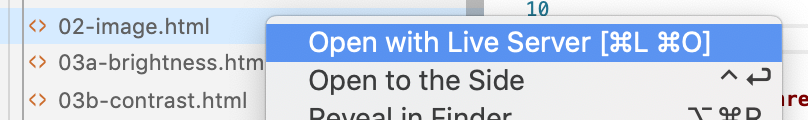

__Note: we've chosen to write all javascript in the html files themselves. While for projects, you might want to use a bundler, this is overkill for the quick demo and prototyping approach we're taking in this course.__

Read through the following chapters in WebGL Fundamentals before continuing:

- [Fundamentals](https://webglfundamentals.org/webgl/lessons/webgl-fundamentals.html)
- [Textures](https://webglfundamentals.org/webgl/lessons/webgl-3d-textures.html)

## Showing an image

Open up [02-image.html](2d/02-image.html) in VSCode and go through the code.

You'll notice a couple of things:

```javascript
const createShader = (gl, type, source) => {
  const shader = gl.createShader(type);
  gl.shaderSource(shader, source);
  gl.compileShader(shader);
  const success = gl.getShaderParameter(shader, gl.COMPILE_STATUS);
  if (success) {
    return shader;
  }
  console.error(gl.getShaderInfoLog(shader));
  gl.deleteShader(shader);
};
```

This function receives a gl context, a type (will be `gl.VERTEX_SHADER` or `gl.FRAGMENT_SHADER`) and a string containing the GLSL source code for the shader. It returns a compiled shader.

```javascript
const createProgram = (gl, vertexShader, fragmentShader) => {
  const program = gl.createProgram();
  gl.attachShader(program, vertexShader);
  gl.attachShader(program, fragmentShader);
  gl.linkProgram(program);
  const success = gl.getProgramParameter(program, gl.LINK_STATUS);
  if (success) {
    return program;
  }
  console.error(gl.getProgramInfoLog(program));
  gl.deleteProgram(program);
};
```

This function receives a gl context, a vertext shader instance and a fragment shader instance (created with `createShader`).

```javascript
const gl = canvas.getContext('webgl');
```

We're getting the context from the canvas as a webgl context. You might have used `2d` contexts before, which would run on the CPU. WebGL contexts will work with shader programs, on the GPU.

```glsl
const vertexShader = createShader(gl, gl.VERTEX_SHADER, `
precision mediump float;

attribute vec2 a_position;
attribute vec2 a_texCoord;

varying vec2 uv;

void main() {     
  gl_Position = vec4(a_position, 1, 1);
  uv = a_texCoord;
}
`);
```

This block compiles a GLSL string to a vertext shader using the createShader function mentioned earlier. A couple of things in there are:

- `attribute vec2 a_position`: an attribute buffer of type vec2 (2d vector). We will provide an array with coordinates as an input, this position is used to calculate the vertex positions on the screen ([clip space - see webglfundamental](https://webglfundamentals.org/webgl/lessons/webgl-fundamentals.html#webgl-hello-world))
- `attribute vec2 a_texCoord`: an attribute which will specify where we sample a color from the texture. It is specified as 2d vectors in uv-coordinate space (values between 0 and 1).
- `varying vec2 uv`: a "varying" type - this is a way to pass values from the vertex shader to the fragment shader. Note that we're setting the value of uv to be the same as the a_texCoord attribute.
- `main()`: this method us run automatically for each pixel when executing the shader.
- `gl_Position`: set this variable to a 4d coordinate (x, y, z, w). As we will be handing 2D logic at first, z and w will be set to 1.

```glsl
const fragmentShader = createShader(gl, gl.FRAGMENT_SHADER, `
precision mediump float;

uniform sampler2D texture;

varying vec2 uv;

void main() {
  gl_FragColor = texture2D(texture, uv);
}
`);
```

Same, but now it's compiling the fragment shader code. A fragment shader is used to determine the target pixel color.

- `uniform sampler2D texture`: the pixels to use as input. In this chapter we will be using images (or videos) as input.
- `varying vec2 uv`: a 2d vector, passed in from our vertex shader.
- `main()`: this method us run automatically for each pixel when executing the shader.
- `gl_FragColor`: the target pixel color as a 4d vector (r,g,b,a). In this example we're just taking the color of the pixel in the texture.

```javascript
const positionAttributeLocation = gl.getAttribLocation(program, "a_position");
const positionBuffer = gl.createBuffer();
```

Get a javascript reference to the `a_position` attribute in the webgl program. Also create a new empty gl buffer. We will be setting this buffer to a value later. There's a similar block for the `a_texCoord` buffer as well.

```javascript
gl.useProgram(program);
```

Tell our webgl context to use the program in the `program` variable. You could have multiple programs in your app.

```javascript
gl.bindBuffer(gl.ARRAY_BUFFER, positionBuffer);
gl.bufferData(
  gl.ARRAY_BUFFER,
  new Float32Array([
      -1.0, 1.0,
      1.0, 1.0,
      -1.0, -1.0,

      -1.0, -1.0,
      1.0, 1.0,
      1.0, -1.0
  ]),
  gl.STATIC_DRAW);
gl.enableVertexAttribArray(positionAttributeLocation);
gl.vertexAttribPointer(positionAttributeLocation, 2, gl.FLOAT, false, 0, 0);
```

Fill the gl buffer with array values, and pass it on in to the attribute. Check [the docs on vertexAttribPointer](https://developer.mozilla.org/en-US/docs/Web/API/WebGLRenderingContext/vertexAttribPointer) for more info on the parameters.

```javascript
const drawScene = () => {
  gl.viewport(0, 0, gl.canvas.width, gl.canvas.height);
  gl.clearColor(0, 0, 0, 0);
  gl.clear(gl.COLOR_BUFFER_BIT);
  gl.useProgram(program);

  gl.drawArrays(gl.TRIANGLES, 0, 6);

  requestAnimationFrame(drawScene);
};
```

This is our render loop, executed on `requestAnimationFrame`. Here we're clearing the canvas and render 2 triangles on the screen. A triangle consists of 3 points. Two times 3 is 6. If we line up the triangles (which happened in the assignment of the position buffer) we draw a rectangle.

__Note: this is a lot of boilerplate code to show an image on the screen. Most of our work during this chapter will be happening in the fragment shader code and providing our fragment shader with extra inputs (uniforms).__

## Basic color adjustments

The most important job of the fragment shader is providing a 4d color vector to `gl_FragColor`. In the show image boilerplate code, we sample a color from a texture and pass that unmodified color to the `gl_FragColor`.

You can do basic image color manipulation, by modifying the value of that sampled color.

For example: you could set the red component to full red:

```glsl
void main() {
  vec4 sampleColor = texture2D(texture, uv);
  sampleColor.r = 1.0;
  gl_FragColor = sampleColor;
}
```

You should see an image with the red channel boosted to max:

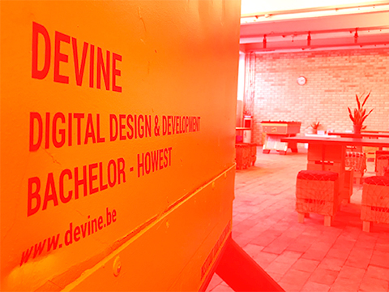

Go through the post [Colour correction with webgl](https://timseverien.com/posts/2020-06-19-colour-correction-with-webgl/) until you reach Colour Matrices. We will cover that a bit later.

### Interactive colour correction

Let's make the amount of brightness, contrast and / or saturation interactive. You can pass values to the webgl shader by providing uniform values.

Define a new uniform float in the top section of your fragment shader:

```glsl
uniform float effectFactor;
```

Use that uniform value as the value for your effect, e.g. brightness adjustment function:

```glsl
sampleColor.rgb = adjustBrightness(sampleColor.rgb, effectFactor);
```

In the global scope of your javascript code, you'll lookup this uniform reference in the program and you'll define a variable as well where you'll store the real javascript value:

```javascript
const effectFactorLocation = gl.getUniformLocation(program, "effectFactor");
let effectFactor = 0;
```

In the `init()` function, you'll listen for mouse move events, and calculate a value between -1 and 1 depending on the horizontal mouse position.

```javascript
canvas.addEventListener('mousemove', (e) => {
  // TODO!!
  // check the e object to determine which property you can use for the x position
  // map this to a range between -1 and 1 (we've provided a map function)
  // set the effectFactor variable
});
```

In our `drawScene()` loop, we can pass this uniform to the shader, before we call into drawArrays:

```javascript
gl.uniform1f(effectFactorLocation, effectFactor);
```

You should end up with something like this:

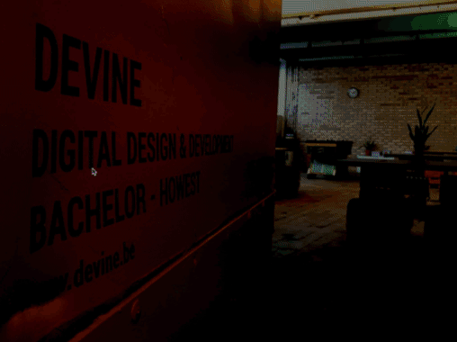

### Color Matrix

Next up, we're going to be using color matrices as a more flexible way of modifying our target color. Each of our filters is currently a multiplication and / or addition of a vector with our original color. By using matrices, we can get rid of the separate formulas in our shader, and use a matrix input which will contain the multiplication and / or sum factors.

Continue [Tim Severien's post on colour correction](https://timseverien.com/posts/2020-06-19-colour-correction-with-webgl/) with the matrix manipulation part. Wait with the filter part for now.

Build a simple slider ui, so you can modify brightness, contrast, exposure and saturation from your javascript code.

Beware: your matrices will need to be transposed when multiplying them. Here's a transpose function you could use for this:

```javascript
const transpose = (out, a) => {
  // If we are transposing ourselves we can skip a few steps but have to cache some values
  if (out === a) {
    let a01 = a[1],
        a02 = a[2],
        a03 = a[3];
    let a12 = a[6],
        a13 = a[7];
    let a23 = a[11];

    out[1] = a[4];
    out[2] = a[8];
    out[3] = a[12];
    out[4] = a01;
    out[6] = a[9];
    out[7] = a[13];
    out[8] = a02;
    out[9] = a12;
    out[11] = a[14];
    out[12] = a03;
    out[13] = a13;
    out[14] = a23;
  } else {
    out[0] = a[0];
    out[1] = a[4];
    out[2] = a[8];
    out[3] = a[12];
    out[4] = a[1];
    out[5] = a[5];
    out[6] = a[9];
    out[7] = a[13];
    out[8] = a[2];
    out[9] = a[6];
    out[10] = a[10];
    out[11] = a[14];
    out[12] = a[3];
    out[13] = a[7];
    out[14] = a[11];
    out[15] = a[15];
  }
  return out;
}
```

For example: when setting the values in the saturation array, you'll transpose them:

```javascript
transpose(u_saturationMatrix, [
  sr + s, sg    , sb    , 0,
  sr    , sg + s, sb    , 0,
  sr    , sg    , sb + s, 0,
  0     , 0     , 0     , 1,
]);
```

Otherwise you'll end up with weird colors, especially with the saturation factors 🌈.

You can [check out the solution](2d/04a-color-matrix.html) when you're stuck.

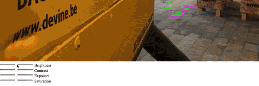

### Precalculate matrices

Right now, we're doing our matrix multiplication per pixel in our shader. We've got a matrix per effect (brightness, contrast, exposure and saturation), so this approach has some overhead (the same resulting matrix with the effect is calculated for each pixel).

We can calculate the effect matrix (eg brightess x contrast x exposure x saturation) once in our javascript code, and send in that effect matrix. This way, our shader will have a bit less work.

Change the fragment shader, so it receives one matrix and offset instead, and uses these to change the pixel color:

```diff
precision mediump float;

uniform sampler2D texture;

- uniform mat4 u_brightnessMatrix;
- uniform vec4 u_brightnessOffset;
- uniform mat4 u_contrastMatrix;
- uniform vec4 u_contrastOffset;
- uniform mat4 u_exposureMatrix;
- uniform vec4 u_exposureOffset;
- uniform mat4 u_saturationMatrix;
- uniform vec4 u_saturationOffset;

+ uniform mat4 matrix;
+ uniform vec4 offset;

varying vec2 uv;

void main() {
  vec4 texel = texture2D(texture, uv);
-  mat4 matrix = u_brightnessMatrix * u_contrastMatrix * u_exposureMatrix * u_saturationMatrix;
-  vec4 offset = u_brightnessOffset + u_contrastOffset + u_exposureOffset + u_saturationOffset;

  gl_FragColor = matrix * texel + offset;
}
```

[Download gl-matrix](http://glmatrix.net) and extract it in your project folder.

Import vec4 and mat4 from gl-matrix in your javascript code. Note: you'll need to set the script type to module in order to do this:

```html
<script type="module">
    import * as mat4 from "./js/gl-matrix/mat4.js";
    import * as vec4 from "./js/gl-matrix/vec4.js";

    const createShader = (gl, type, source) => {
    
    // etc...
```

Add a general matrix and offset, which will store the multiplications and sums of all these matrices and offsets:

```javascript
const matrix = mat4.create();
const offset = vec4.create();
```

These create methods just create regular arrays. You can modify the matrices and offsets you've already got for the effect to use these create methods, or just leave them as they are right now.

We'll no longer need the uniform locations to the separate effects, but will need uniform locations for the general matrix and offset:

```diff
- const u_brightnessMatrixLocation = gl.getUniformLocation(program, "u_brightnessMatrix");
- const u_brightnessOffsetLocation = gl.getUniformLocation(program, "u_brightnessOffset");

- const u_contrastMatrixLocation = gl.getUniformLocation(program, "u_contrastMatrix");
- const u_contrastOffsetLocation = gl.getUniformLocation(program, "u_contrastOffset");

- const u_exposureMatrixLocation = gl.getUniformLocation(program, "u_exposureMatrix");
- const u_exposureOffsetLocation = gl.getUniformLocation(program, "u_exposureOffset");

- const u_saturationMatrixLocation = gl.getUniformLocation(program, "u_saturationMatrix");
- const u_saturationOffsetLocation = gl.getUniformLocation(program, "u_saturationOffset");

+ const matrixLocation = gl.getUniformLocation(program, "matrix");
+ const offsetLocation = gl.getUniformLocation(program, "offset");
```

Finally, you'll be doing the matrix calculations in your draw loop:

```javascript
mat4.identity(matrix);
mat4.multiply(matrix, matrix, u_brightnessMatrix);
mat4.multiply(matrix, matrix, u_contrastMatrix);
mat4.multiply(matrix, matrix, u_exposureMatrix);
const saturationTransposed = mat4.create();
mat4.transpose(saturationTransposed, u_saturationMatrix);
mat4.multiply(matrix, matrix, saturationTransposed);

vec4.zero(offset);
vec4.add(offset, offset, u_brightnessOffset);
vec4.add(offset, offset, u_contrastOffset);
vec4.add(offset, offset, u_exposureOffset);
vec4.add(offset, offset, u_saturationOffset);

gl.uniformMatrix4fv(matrixLocation, false, matrix);
gl.uniform4fv(offsetLocation, offset);
```

Test your app, the result should be the same as previous, but the improvement 

### Effects

Continue with [the post on colour corrections](https://timseverien.com/posts/2020-06-19-colour-correction-with-webgl/) and implement the effects part. The big difference is you'll be using precalculated matrices instead of having a separate effect matrix.

You can find a couple of [effect matrices in the Doka documentation](https://pqina.nl/doka/docs/patterns/api/doka-instance/#setting-filters).

As a final exercise, we'll animate between our regular colors and the effect colors:

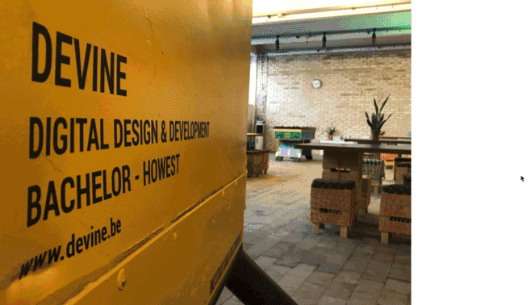

There's a builtin function in GLSL to interpolate between values: [the mix function](https://thebookofshaders.com/glossary/?search=mix).

First of all, we'll prepare our fragment shader. Add an extra uniform `effectFactor`:

```glsl
uniform float effectFactor;
```

This effectFactor will be a value between 0 and 1. 0 will be: use the original color, 1 will be: use the modified effect color. Values between that should interpolate between those 2 colors:

```glsl
void main() {
  vec4 sampleColor = texture2D(texture, uv);
  vec4 filteredColor = matrix * sampleColor + offset;
  gl_FragColor = mix(sampleColor, filteredColor, effectFactor);
}
```

Create a global effectFactor variable and get a reference to it's uniform location. Add listeners to mouseover and mouseout to set that variable (we won't do animation in this first iteration):

```javascript
canvas.addEventListener('mouseover', e => {
  effectFactor = 1;
});

canvas.addEventListener('mouseout', e => {
  effectFactor = 0;
});
```

In the draw loop, you'll pass this effectFactor into the shader:

```javascript
gl.uniform1f(effectFactorLocation, effectFactor);
```

You should see the colors switch on hover.

### Animated effect

To animate our effectFactor, we'll use [the GSAP animation library](https://greensock.com/docs/v3/Eases).

Add a script tag before your own script tag to load it from a CDN:

```html
<script src="https://cdnjs.cloudflare.com/ajax/libs/gsap/3.5.1/gsap.min.js" integrity="sha512-IQLehpLoVS4fNzl7IfH8Iowfm5+RiMGtHykgZJl9AWMgqx0AmJ6cRWcB+GaGVtIsnC4voMfm8f2vwtY+6oPjpQ==" crossorigin="anonymous"></script>
```

If you take a look at [the GSAP docs](https://greensock.com/docs/v3/Eases), you'll notice that GSAP works by modifying object properties. You can't animate a regular variable.

Modify the effectFactor definition to wrap it inside of an object:

```javascript
const properties = {
  effectFactor: 0
};
```

In the mouse events, you'll animate this property:

```javascript
gsap.to(properties, { duration: 1, ease: "power4.out", effectFactor: 1});
```

Don't forget to modify the code where you're passing the effectFactor into the shader:

```javascript
gl.uniform1f(effectFactorLocation, properties.effectFactor);
```

## Kernels

Up until now, we've modified the color of a pixel with an operation which multiplies the original pixel with a matrix.

The next step is look at adjacent pixels, and take those color values into account as well. This way you can create effects such as edge detection (high contrast with adjacent pixel means there is an edge) and blur effects (calculate the color as an average color of adjacent pixels).

Work through the steps at [webgl image processing](https://webglfundamentals.org/webgl/lessons/webgl-image-processing.html), starting from the alinea _"What if we want to do image processing that actually looks at other pixels?"_.

## 2D Displacement maps

Another technique to modify pixel colors is through displacement maps. Instead of using a matrix or a buffer as an input modifyer, you can use a second texture as a data source. You can use the color value of this second texture as a modification value for the sampled color of your main texture.

In the fragment shader, you'll have 2 images: the image itself and a displacement texture:

```glsl
uniform sampler2D texture;
uniform sampler2D disp;
```

The sampling position gets influenced by the red channel of the displacement texture:

```glsl
float effectFactor = 0.05;
vec2 distortedPosition = vec2(uv.x + disp.r * effectFactor, uv.y);
gl_FragColor = texture2D(texture, distortedPosition);
```

Applying a black and white displacement map such as the one below:

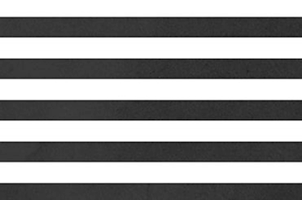

Would result in the effect below:

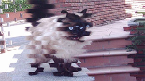

Things get even more interesting when you start animating the displacement factor from the shader. You can animate the uniform value on hover, like we did in the previous project:

```javascript
canvas.addEventListener('mouseover', () => gsap.to(properties, { duration: 1, ease: "power4.out", effectFactor: 1}));
canvas.addEventListener('mouseout', () => gsap.to(properties, { duration: 1, ease: "power4.out", effectFactor: 0}));
```

On hover, you'll get the following effect:

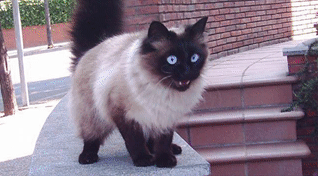

Try implementing this displacement effect by yourself. There's a couple of displacement maps for you to test in the [2d/images/displacement](2d/images/displacement) folder.

### Displacement transition between images

You could also mix 2 images using this displacement value. To do so, you would add yet another texture, so you'd have 3:

- image 1
- image 2
- displacement map

In the fragment shader logic, you would calculate 2 displacement positions. One of them being the inverse-effect-position (by doing 1.0 minus the displacement factor):

```glsl
vec4 disp = texture2D(disp, uv);
vec2 distortedPosition = vec2(uv.x + dispFactor * (disp.r*effectFactor), uv.y);
vec2 distortedPosition2 = vec2(uv.x - (1.0 - dispFactor) * (disp.r*effectFactor), uv.y);
```

You would then use these two distortedPosition vectors to sample a color from each of the 2 images:

```glsl
vec4 _texture = texture2D(texture, distortedPosition);
vec4 _texture2 = texture2D(texture2, distortedPosition2);
```

And use the mix function to interpolate between the two:

```glsl
gl_FragColor = mix(_texture, _texture2, dispFactor);
```

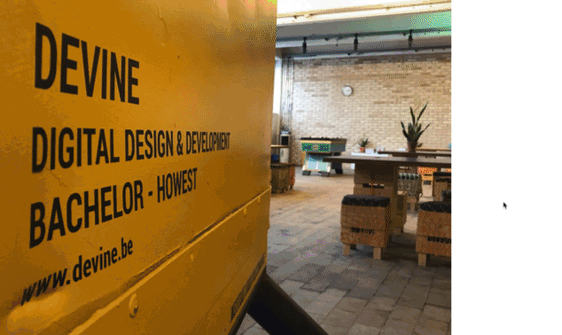

## Ripple effect

Up until now, we've used textures as input for our origin image and displacement map. Using some creative math, you can also generate pixel colors yourself.

Restart from the basic show image project.

We'll create some concentric ovals, using just math. In your fragment shader, calculate the distance of the uv coordinate to the center uv:

```glsl
float distance = length(uv - vec2(0.5, 0.5));
```

Using a `sin` function, we can calculate the sine waveform from that distance. When multiplying this with a vec4 and setting that as the gl_FragColor you can visualize the results:

```glsl
vec4 disp = vec4(1.0, 1.0, 1.0, 1.0);
disp.rgb *= sin(distance);
gl_FragColor = disp;
```

You should see a fade from a black center to a grey border:

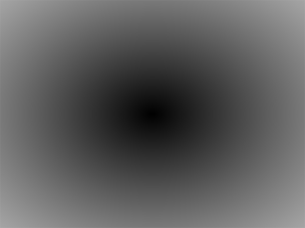

Our distance will be a value between 0 and 0.5, which is quite a small range for the sine function. If you multiply this value with a larger number, things become more interesting:

```glsl
disp.rgb *= sin(distance * 20.0);
```

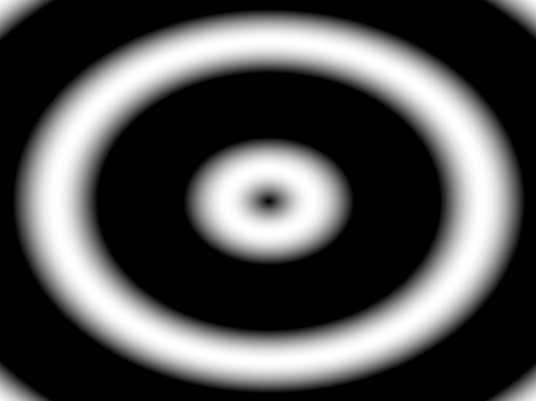

We can animate these circles, by adding a "phase offset" to the sine calculation.

Define a new uniform float phase:

```glsl
uniform float phase;
```

And add this uniform value to the sine calculation:

```glsl
disp.rgb *= sin(distance * 20.0 + phase);
```

In your javascript, you'll need to reference this uniform, so store it's location in a global const:

```javascript
const phaseLocation = gl.getUniformLocation(program, "phase");
```

In the drawloop, we'll update this value. You can take advantage of the fact that requestAnimationFrame receives a timing offset in the function call. So change the signature of the drawScene to capture this time:

```javascript
const drawScene = (time = 0) => {
```

And pass it to the phase uniform, before doing drawArrays. Make sure to divide it by a factor, otherwise the circle will move too fast:

```javascript
gl.uniform1f(phaseLocation, time / 100);
```

You should see the circles moving:

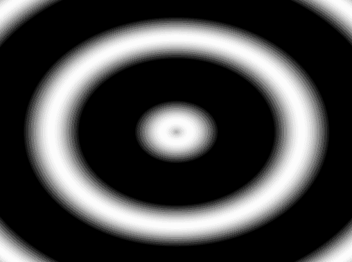

We've now got an animating, black and white image... We can use this as an input for a displacement effect!

Take a look at the previous exercise, where you used a texture value as displacement factor (the single image, not the transition between images). Use our concentric circle as the displacement factor. You should have the following result:

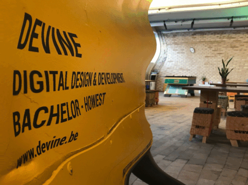

As a final step, try adding hover interaction to the page, so the effect only triggers when hovering over the image.

## Warp effect

As a next exercise, we want to create a warp effect - as described at https://stackoverflow.com/questions/46857876/old-school-tv-edge-warping-effect

Start off from the [basic image example](2d/02-image.html). We're only interested in the warping effect, we'll ignore the horizontal stripes and color shift.

In the stackoverflow post you'll find the following block of shader code:

```glsl
vec2 ndc_pos = vertPos;
vec2 testVec = ndc_pos.xy / max(abs(ndc_pos.x), abs(ndc_pos.y));
float len = max(1.0,length( testVec ));
ndc_pos *= mix(1.0, mix(1.0,len,max(abs(ndc_pos.x), abs(ndc_pos.y))), u_distortion);
vec2 texCoord = vec2(ndc_pos.s, -ndc_pos.t) * 0.5 + 0.5;
```

In the shader code above, they're using the xy vertex position in the fragment shader. In order to access this, you can pass it as a varying from the vertex shader to the fragment shader.

Define the vertPos as a varying vec2 in __both__ your vertex and fragment shader:

```glsl
varying vec2 vertPos;
```

Set this vertPos at the end of the main() function of your __vertex__ shader:

```glsl
vertPos = gl_Position.xy;
```

You'll need a `uniform float u_distortion` in the fragement shader as well:

```glsl
uniform float u_distortion;
```

Get this uniform location in your javascript code, and initialize it to a value of 1.0. You should see something like this:

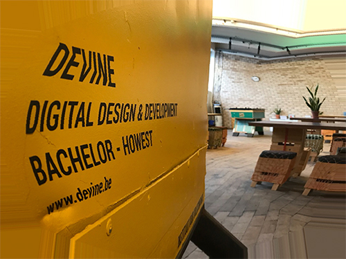

If you take a closer look at the edges, you'll notice that the pixels are repeating (for example: look at the floor on the bottom right of the image). That's because our shader is sampling colors outside of the 0-1 uv coordinate space, and falls back to the last available pixel for the edge.

A quick approach is by adding a couple of if-statements and multiplying the color by 0 if the `texCoord` falls outside of our 0-1 range:

```glsl
vec4 sampleColor = texture2D(texture, texCoord);

if (texCoord.x < 0.0) {
  sampleColor *= 0.0;
}

gl_FragColor = sampleColor;
```

Write the 3 other statements checking if x and y are between 0 and 1. You should see the following result:

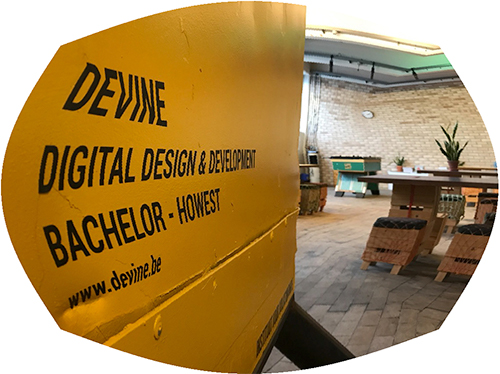

We're kind of there... but not quite yet. You'll see some heavy aliasing at the edges.

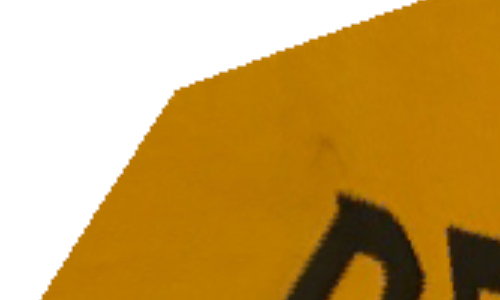

This is happening because we straight going from a full color to none. We can get rid of this by using a slight "gradient" at the edges.

To make coding a little easier, we'll make our mask visible instead of the resulting image. Replace your previous if/else logic, with the following:

```glsl
float mask = 1.0;

if (texCoord.x < 0.0) {
  mask = 0.0;
}
if (texCoord.x > 1.0) {
  mask = 0.0;
}
if (texCoord.y < 0.0) {
  mask = 0.0;
}
if (texCoord.y > 1.0) {
  mask = 0.0;
}

vec4 maskPreview = vec4(mask, mask, mask, 1.0);

gl_FragColor = maskPreview;
```

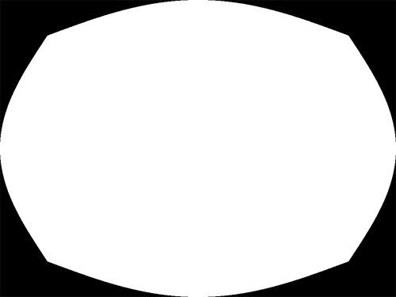

An alternative approach to using if/else statements, is using [the glsl step function](https://thebookofshaders.com/glossary/?search=step). This function takes 2 parameters: an edge (threshold value) and a value. Read more about this at [https://thebookofshaders.com/glossary/?search=step](https://thebookofshaders.com/glossary/?search=step).

Replace the if/else statements, with the following step function call

```glsl
float mask = 1.0;
mask *= step(0.0, texCoord.x);
```

This should give you the result below:

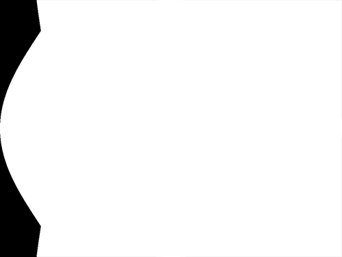

Try figuring out the other 3 step function calls, so you get the same mask as before:


You can [take a peek at the solution](2d/08d-warp-mask-step.html) if you're stuck.

Ok, we're back to an aliased mask... but what we want is a small gradient at the edges. This is where [smoothstep](https://thebookofshaders.com/glossary/?search=smoothstep) comes in. This function expects 3 parameters: 2 parameters describing your threshold space (min and max threshold) and a value. It will create a smooth interpolation for values within the threshold space. Read more about this at [https://thebookofshaders.com/glossary/?search=smoothstep](https://thebookofshaders.com/glossary/?search=smoothstep).

Try implementing this smoothstep yourself, and aim for the following result:


As always, there's a [solution of the current state](2d/08e-warp-mask-smoothstep.html) available.

If you'd apply the calculate mask float with the sampleColor

```glsl
gl_FragColor = sampleColor * mask;
```

you'd get a masked version of the image:

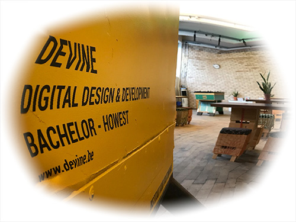

We're almost there! Try making the gradient space as small as possible (find the sweet spot between having a small gradient and an aliased edge). See if you can get the warp activate on hover, so you get the following effect:

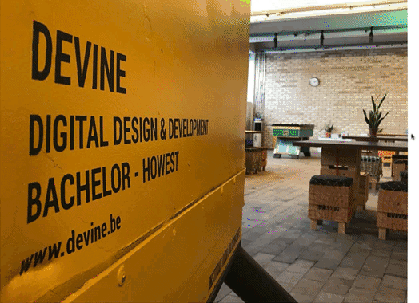

## Interactive Masks

As you've seen in the previous exercise, masking in a fragment shader is quite easy: multiply your fragment color with a value between 0 and 1, and you've got a mask.

Let's start from the basic image example again and build our way up.

We've prepared a small black-and-white image, which we'll use as our mask:


1. Load this image as an extra texture
2. Sample it's color at the same uv coordinate as the texture
3. Use it's red channel as your mask multiplier

You should get the following result:

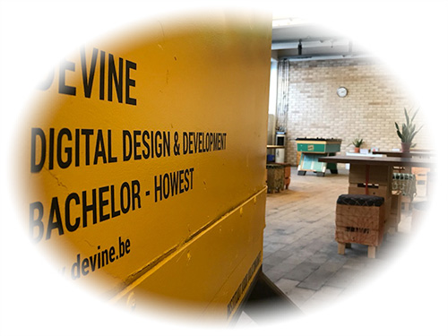

By taking the same UV coordinates as the image, we're stretching the mask. We want to keep the original mask size.

To do this, we'll need to know the original size of the mask and the original size of the image.

Create 2 uniforms in your fragment shader to store these sizes:

```glsl
uniform vec2 textureSize;
uniform vec2 maskSize;
```

In your init function, right after uploading your two textures, you should set these uniforms. You'll need to get their locations as well, but I figure you know how to do this by now 😉:

```javascript
gl.uniform2f(textureSizeLocation, imgTexture.width, imgTexture.height);
gl.uniform2f(maskSizeLocation, maskTexture.width, maskTexture.height);
```

Back to the fragment shader. We can now use these sizes to calculate the uv coordinate we need to use in for the mask sample:

```glsl
vec2 maskScale = maskSize / textureSize;
vec2 maskCoord = uv / maskScale;
```

Use this maskCoord as the sample location in your mask texture, so you get the following result:

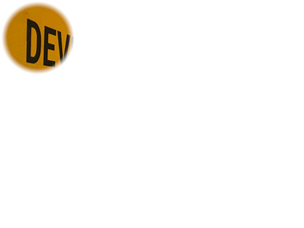

Our next step is making the mask follow the cursor position. Add an additional uniform to use as an offset for our mask:

```glsl
uniform vec2 maskOffset;
```

and use this maskOffset in the calculation of the maskCoord:

```glsl
vec2 maskCoord = (uv - maskOffset) / maskScale;
```

In your init function, you'll add a listener to the `mousemove` event, where you'll set this maskOffset. Try figuring out the correct calculation, based on the event properties, the size of the mask and the size of the canvas. The resulting values should be within the 0-1 coordinate space!

```javascript
canvas.addEventListener('mousemove', e => {
  const maskX = // TODO: calculate relative offset x
  const maskY = // TODO: calculate relative offset y

  console.log(maskX, maskY);

  gl.uniform2f(maskOffsetLocation, maskX, maskY);
});
```

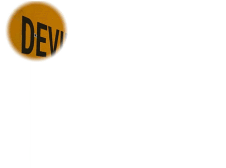

We can also apply distortion effects to our mask. Remember the ripple effect with the circles? When applying this to the mask coordinate, you can get a more interesting animated mask.

```glsl
float distance = length( uv - vec2(0.5));
vec4 disp = vec4(0.01, 0.01, 0.01, 0.01);
disp.rgb *= sin(distance*25.0+phase);

vec2 distortedPosition = vec2(uv.x + disp.r * effectFactor, uv.y + disp.r * effectFactor);

vec2 maskScale = maskSize / textureSize;
vec2 maskCoord = (distortedPosition - maskOffset) / maskScale;
```

Try incorporating the distortion to the mask, so you get the following result:

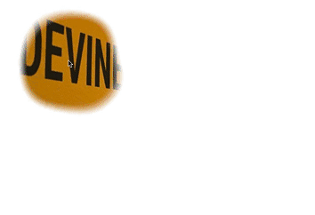

## Selective translation

Another technique we can use it show another region of an image under the mask.

Take a look at the image below (graphics for Volkswagen project by [Bavo Vanderghote](https://www.behance.net/bavo)):

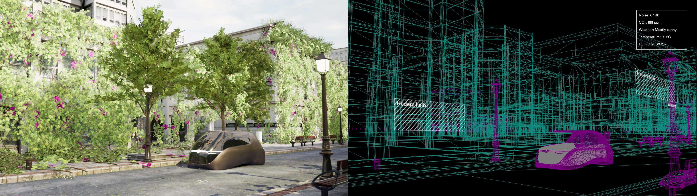

The left part of the image is a rendered frame, the right part of the image is the wireframe version.

We'll display the rendered section for the most part, underneath our mask we'll show the wireframe version.

Start from [the solution of the previous exercise](2d/09c-mark-animated.html) and load [the volkswagen image](2d/images/vw.jpg) instead.

The canvas is quite large, so auto-size it to the width of the body using some css:

```html
<style>
  canvas {
    width: 100%;
    height: auto;
  }
</style>
```

In your fragment shader, you'll calculate a new UV coordinate for the left part of the image:

```glsl
vec2 leftUV = vec2(uv.x / 2.0, uv.y);
```

Use this `leftUV` coordinate for the color sampling, and comment out the masking factor for now:

```glsl
gl_FragColor = texture2D(texture, leftUV); // * maskColor.r;
```

You should get the following result:

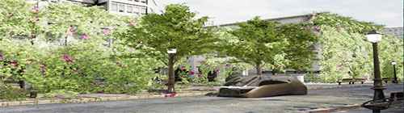

We're only seeing the left part, but it is stretched to double it's width. This is because we're using the full width of the image for the textureSize __and__ the canvas.

Adjust the javascript code to divide the width here as well:

```javascript
gl.uniform2f(textureSizeLocation, imgTexture.width / 2, imgTexture.height);

canvas.width = imgTexture.width / 2;
```

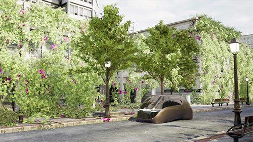

Calculate a `rightUV` as well for displaying the right side of the image, and test rendering this image sample as well:

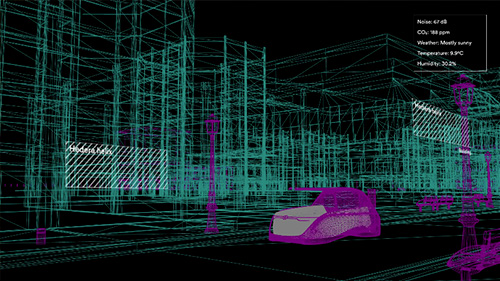

Let's add the masking interaction again. What we'll do is sample both the leftUV and rightUV coordinate, and mix the colors depending on the masking value:

```glsl
gl_FragColor = mix(texture2D(texture, leftUV), texture2D(texture, rightUV), maskColor.r);
```

Test the app. You'll notice we're kind-of there, but the mouse coordinates are off for some reason:

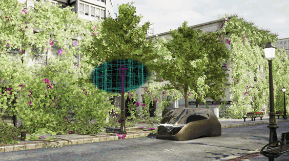

This has to do with the fact that we've resized our canvas using css. We need to calculate the resulting canvas scale, and apply this scaling to our mouse coordinate as well.

You can calculate the scaling ratio in the mouse move handler as follows:

```javascript
const canvasSize = canvas.getBoundingClientRect();
const canvasScale = canvas.width / canvasSize.width;
```

See where to apply the `canvasScale` number to, in order to get the coordinates working again:

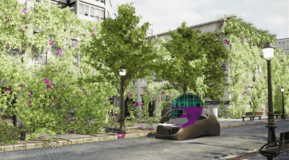

## Using videos as textures

You're not just limited to static images as textures: you can use videos as well.

Start off from [the ripple effect solution](2d/07d-ripple-final.html).

Add a video tag below the canvas, you can [use our showreel](2d/videos/showreel-2020.mp4) as a source:

```html
<video id="video" src="videos/showreel-2020.mp4"></video>
```

Get a javascript reference to this video tag, similar to how we've referenced the canvas tag:

```javascript
const $video = document.querySelector('#video');
```

Get rid of the imgTexture and use this $video element instead:

```javascript
uploadImageToTexture($video, "texture", 0);
gl.uniform1f(effectFactorLocation, properties.effectFactor);

canvas.width = $video.width;
canvas.height = $video.height;
```

When loading in the browser, you'll notice the canvas has a width and height of 0 (check the element inspector). In your devtools, you'll see the following error:

> WebGL: INVALID_VALUE: texImage2D: no video

This has to do with the fact that the video has not loaded yet when sending it over to our shader.

We'll need to wait for [the canplay event](https://developer.mozilla.org/en-US/docs/Web/API/HTMLMediaElement/canplay_event) before sending it over to our shader. Wrap the texture upload & the rest of the init function inside of the canplay handler:

```javascript
$video.addEventListener('canplay', () => {
  console.log('can play');
  uploadImageToTexture($video, "texture", 0);
  gl.uniform1f(effectFactorLocation, properties.effectFactor);

  canvas.width = $video.width;
  canvas.height = $video.height;

  canvas.addEventListener('mouseover', () => gsap.to(properties, { duration: 1, ease: Power4.easeOut, dispFactor: 1}));
  canvas.addEventListener('mouseout', () => gsap.to(properties, { duration: 1, ease: Power4.easeOut, dispFactor: 0}));

  drawScene();
});
```

You'll still have a canvas size of zero, but you might see the same error:

> can play
> 
> WebGL: INVALID_VALUE: texImage2D: no video

You can get the native size of the video through the `.videoWidth` and `.videoHeight` properties. Use those when setting the canvas size instead of just `.width` and `.height`:

```javascript
canvas.width = $video.videoWidth;
canvas.height = $video.videoHeight;
```

At time of writing, adding this resulted in showing the first frame in Safari. In Chrome, I still saw that same `INVALID_VALUE` error.

Adding a `preload` attribute to our video tags fixes the issue in Chrome:

```html
<video id="video" src="videos/showreel-2020.mp4" preload="auto"></video>
```

You should see the first frame of the video in all browsers.

### Playing the video

Of course we don't want to show a static frame, we want to play the video. Let's try by adding a `play()` call in the `canplay` handler:

```javascript
console.log('can play');
$video.play();
```

When trying this approach, you'll get an error, indicating the user needs to interact with the document first before video playback is allowed:

> DOMException: play() failed because the user didn't interact with the document first

We could solve this by adding a dedicated play button on the page and starting playback when the user clicks that button. However: if you don't need sound to be active, you still can autoplay videos!

Get rid of that `.play()` call first, and add the html attributes `autoplay`, `muted` and `playsinline` to your video tag:

```html
<video id="video" src="videos/showreel-2020.mp4" preload="auto" autoplay playsinline muted></video>
```

Reload the browser, and you should see the video playing. The canvas is still frozen on the first frame though.

### Updating the video texture

When uploading a texture, it passes that texture as a static collection of pixel values, no matter if it's coming from an image or a video tag. You'll need to update the texture during our requestAnimationFrame loop.

Add the upload call before doing drawArray in the drawScene method:

```javascript
uploadImageToTexture($video, "texture", 0);

gl.drawArrays(gl.TRIANGLES, 0, 6);
```

Test the app again. At time of writing this works nicely in Google Chrome. In Safari however, the canvas is flashing all over the place.

This has to do with the fact that a new texture instance is created every time we call into uploadImageToTexture. We want to avoid creating new instances 60 times per second of course.

We'll add a check in `uploadImageToTexture` to see if we've created a texture instance for a given name yet. We'll store the texture instances in a dictionary lookup `textures`:

```diff
+ const textures = {};

const uploadImageToTexture = (img, uniformName, textureUnitIndex) => {
  const u_imageLoc = gl.getUniformLocation(program, uniformName);
  gl.uniform1i(u_imageLoc, textureUnitIndex);

+ if (!textures[uniformName]) {
+   textures[uniformName] = gl.createTexture();
+ }

+ const texture = textures[uniformName];
- const texture = gl.createTexture();
  gl.activeTexture(gl.TEXTURE0 + textureUnitIndex);
  gl.bindTexture(gl.TEXTURE_2D, texture);

  // Set the parameters so we can render any size image.
  gl.texParameteri(gl.TEXTURE_2D, gl.TEXTURE_WRAP_S, gl.CLAMP_TO_EDGE);
  gl.texParameteri(gl.TEXTURE_2D, gl.TEXTURE_WRAP_T, gl.CLAMP_TO_EDGE);
  gl.texParameteri(gl.TEXTURE_2D, gl.TEXTURE_MIN_FILTER, gl.NEAREST);
  gl.texParameteri(gl.TEXTURE_2D, gl.TEXTURE_MAG_FILTER, gl.NEAREST);

  // Upload the image into the texture.
  gl.texImage2D(gl.TEXTURE_2D, 0, gl.RGBA, gl.RGBA, gl.UNSIGNED_BYTE, img);
};
```

Try again: the app should run smoothly in all browsers. On hover, you'll see the ripple effect playing on moving content.

## Using a Shadertoy shader

You can find all sorts of impressive shader demos at https://shadertoy.com. Some of these shaders are proof-of-concept demos of what's possible by just using GLSL, but not necessarily best practices when having an effect in mind. But there are quite a few shaders there we can use as a source of inspiration for our own work.

It's not as simple as just copy/pasting the code in your work, you'll need to do a few tweaks first.

Start off from the basic image example again. We'll implement the shader from https://www.shadertoy.com/view/Xsl3zn in our own code.

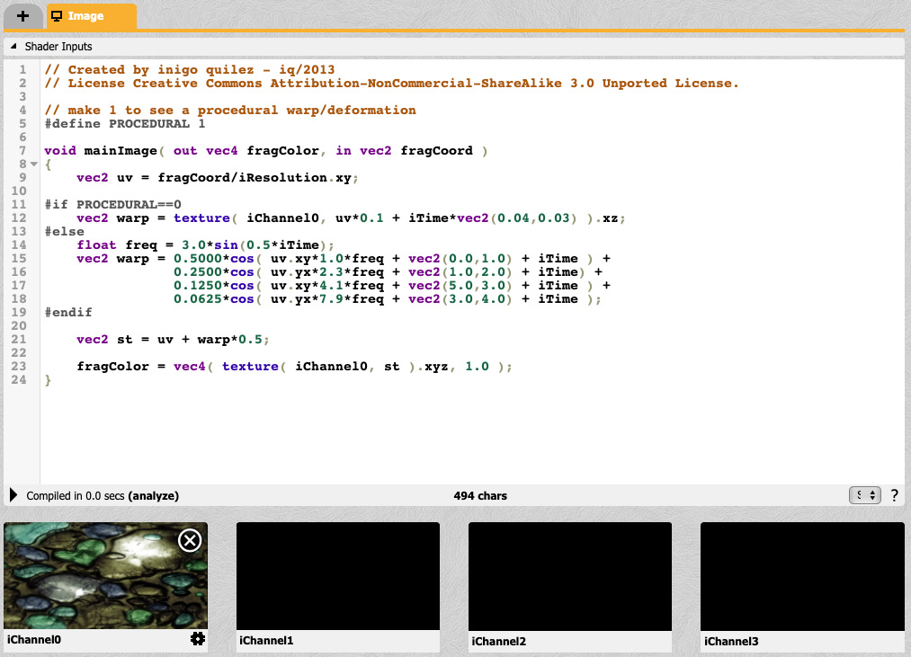

The main entrypoint of a shadertoy shader is a function called `mainImage` which receives 2 parameters as you can see in the screenshot above:

- `out vec4 fragColor` - assigning this variable will set the output color
- `in vec2 fragCoord` - this variable contains the x and y coordinate of the pixel

Append the contents of the shadertoy shader to your fragment shader code and reload. You'll get a bunch of errors, such as:

> WebGL: ERROR: 0:20: 'iResolution' : undeclared identifier
>
> WebGL: ERROR: 0:20: 'xy' :  field selection requires structure or vector on left hand side
>
> WebGL: ERROR: 0:25: 'iTime' : undeclared identifier

A Shadertoy shaders receives a bunch of extra inputs, which are not listed in the code. If you expand the Shader Inputs section, you'll see an overview of these inputs:

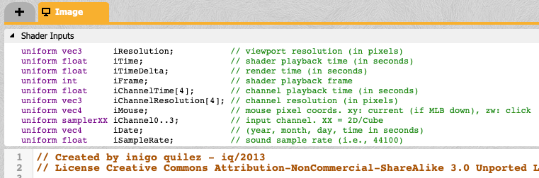

Look at the shadertoy code itself, and declare the necessary inputs (so: only the ones you're seeing being used) in the top section of your fragment shader code.

You might get an error on the iChannelXXX syntax:

> WebGL: ERROR: 0:8: 'iChannel0' : syntax error

Actually, this should be our texture input. So: get rid of the `uniform samplerXX iChannel0...3` declaration and rename `uniform sampler2D texture;` to `uniform sampler2D iChannel0;`

Another error you'll get is:

> WebGL: ERROR: 0:12: 'texture' : no matching overloaded function found

Make sure to call texture2D instead:

```diff
- vec2 warp = texture( iChannel0, uv*0.1 + iTime*vec2(0.04,0.03) ).xz;
+ vec2 warp = texture2D( iChannel0, uv*0.1 + iTime*vec2(0.04,0.03) ).xz;
```

```diff
- fragColor = vec4( texture( iChannel0, st ).xyz, 1.0 );
+ fragColor = vec4( texture2D( iChannel0, st ).xyz, 1.0 );
```

The code should run again, but no effect is applied. [Compare with the solution](2d/12b-shadertoy-compiles.html) if you're stuck.

### Calling the mainImage function

We're not calling the mainImage function yet, our main function is still a simple sampler of our texture.

Change the `main()` function, so it calls the `mainImage()` function:

```glsl
void main() {
  mainImage(gl_FragColor, gl_FragCoord.xy);
}
```

Depending on the order of your fragment shader code, you'll either see a single color, or an error:

> WebGL: ERROR: 0:9: 'mainImage' : no matching overloaded function found

Make sure you move your `main()` function to the bottom of the fragment shader. This way the `mainImage` function will be parsed and known to the `main()` function.

### Providing the correct uniform values

You've added 2 uniforms for this particular shader:

```glsl
uniform vec3 iResolution;
uniform float iTime;
```

Try giving them the correct values from your javascript code. We've used similar inputs in previous exercises 😁

You'll see an upside down version of your image:

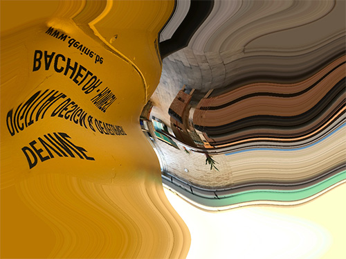

### Fixing the final issues

Flipping the image vertically is as simple as inverting the `uv.y` coordinate:

```glsl
uv.y = 1.0 - uv.y;
```

Don't like the stripe-repeats at the edges? You can implement the `smoothstep` masking approach from earlier!

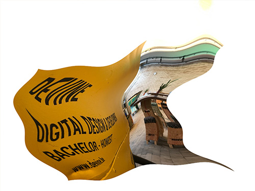

# WebGL 3D - Three.js

Survived the WebGL 2D part? Let's add the 3rd dimension to our apps!

Doing 2D WebGL might have seemed a lot of work already, and things get a bit more complicated when we start adding the 3rd dimension. This is why we'll use [Three.js](https://threejs.org/) to abstract some of the math and shader stuff.

Three.js itself has some great [documentation](https://threejs.org/docs/index.html#manual/en/introduction/Creating-a-scene) and [an extensive list of examples](https://threejs.org/examples/).

To learn how to work with Three.js, we are going to go with the lesson series at https://threejs.org/manual/#en/fundamentals. We'll go through some of the pages there, before creating an interactive 3D WebGL experience.

## Hello Three.js

To be able to run of the Thee.js code, you'll need to link the Three.js library. We'll just use the CDN for now. And, as you're just experimenting and learning right now, you don't really need to go through the trouble of settings up a bundler / transpiler.

To tell our browser where to find the threejs module, add an `<script type="importmap">` tag to your html:

```html
<script type="importmap">{
  "imports": {
    "three": "https://unpkg.com/three@0.156.0/build/three.module.js",
    "three/addons/": "https://unpkg.com/three@0.156.0/examples/jsm/"
  }
}</script>
```

You'll write your code in a second script tag, with type module. This way you can use the import syntax to import the Three.js library:

```html
<script type="module">
  import * as THREE from 'three';
</script>
```

You'll start by going through the page at https://threejs.org/manual/#en/fundamentals where you'll build a basic Three.js scene, familiarizing yourself with some basic Three.js concepts.

Work your way through the following lessons:

- https://threejs.org/manual/#en/responsive
- https://threejs.org/manual/#en/primitives
- https://threejs.org/manual/#en/scenegraph

Read up on materials at https://threejs.org/manual/#en/materials

And continue coding with:

- https://threejs.org/manual/#en/textures (up until Filtering and Mips)

After handling the basics of textures, read through the following pages, and check the live demos. No need to code these yourself, just get yourself familiar with the different types and options:

- https://threejs.org/manual/#en/lights
- https://threejs.org/manual/#en/cameras
- https://threejs.org/manual/#en/shadows

## The Aviator

We'll build a fun little interactive 3D scene, based on the tutorial at https://tympanus.net/codrops/2016/04/26/the-aviator-animating-basic-3d-scene-threejs/. Since that tutorial was written, there have been a few changes to threejs, so the guide in this course will be slightly different.

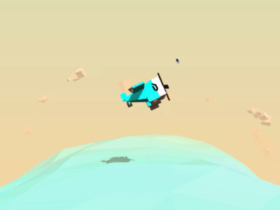

Start with a basic html file, which as a couple of style rules to make sure the canvas is fullscreen and our body has a gradient background:

```html
<!DOCTYPE html>
<html lang="en">
<head>
  <meta charset="UTF-8">
  <meta name="viewport" content="width=device-width, initial-scale=1.0">
  <meta http-equiv="X-UA-Compatible" content="ie=edge">
  <title>The Aviator</title>
  <style>
    html, body {
      margin: 0;
      height: 100%;
    }
    body {
      background: linear-gradient(#e4e0ba, #f7d9aa);
    }
    #c {
      width: 100%;
      height: 100%;
      display: block;
    }
  </style>
</head>
<body>
  <canvas id="c"></canvas>
  <script src="js/script.js" type="module"></script>
</body>
</html>
```

In the script.js tag we add the basic boilerplate to setup a renderer, scene and camera, with resize logic as well. Make sure to either add the import maps for three in your html file, or use a bundler to import the threejs library.

```javascript
import * as THREE from 'three';

const canvas = document.querySelector('#c');
const renderer = new THREE.WebGLRenderer({
  canvas,
  alpha: true,
  antialias: true
})

const fov = 60;
const aspect = 2;
const near = 1;
const far = 10000;
const camera = new THREE.PerspectiveCamera(fov, aspect, near, far);
camera.position.y = 100;
camera.position.z = 200;

const scene = new THREE.Scene();
scene.fog = new THREE.Fog(0xf7d9aa, 100, 950);

const init = () => {
  requestAnimationFrame(render);
};

const render = () => {
  if (resizeRendererToDisplaySize(renderer)) {
    const canvas = renderer.domElement;
    camera.aspect = canvas.clientWidth / canvas.clientHeight;
    camera.updateProjectionMatrix();
  }

  renderer.render(scene, camera);
  requestAnimationFrame(render);
};

const resizeRendererToDisplaySize = (renderer) => {
  const canvas = renderer.domElement;
  const pixelRatio = window.devicePixelRatio;
  const width  = canvas.clientWidth  * pixelRatio | 0;
  const height = canvas.clientHeight * pixelRatio | 0;
  const needResize = canvas.width !== width || canvas.height !== height;
  if (needResize) {
    renderer.setSize(width, height, false);
  }
  return needResize;
}

init();
```

### Defining some colors

Create a file `constants/colors.js` which exports a colors const:

```javascript
export const Colors = {
  red:0xf25346,
  white:0xd8d0d1,
  brown:0x59332e,
  pink:0xF5986E,
  brownDark:0x23190f,
  blue:0x68c3c0,
};
```

### Creating your first mesh

Let's create a mesh for the sea. Add a file `objects/sea.js` with the following code:

```javascript
import * as THREE from 'three';
import { Colors } from '../constants/colors';

export const createSea = () => {
  // create the geometry (shape) of the cylinder;
  // the parameters are: 
  // radius top, radius bottom, height, number of segments on the radius, number of segments vertically
  const geom = new THREE.CylinderGeometry(600,600,800,40,10);
  
  // rotate the geometry on the x axis
  geom.applyMatrix4(new THREE.Matrix4().makeRotationX(-Math.PI/2));
  
  // create the material 
  const mat = new THREE.MeshPhongMaterial({
    color:Colors.blue,
    transparent:true,
    opacity:.6,
    flatShading: true,
  });

  // To create an object in Three.js, we have to create a mesh 
  // which is a combination of a geometry and some material
  const mesh = new THREE.Mesh(geom, mat);

  // Allow the sea to receive shadows
  mesh.receiveShadow = true;

  return {
    mesh
  }
};
```

This method returns an object, with a property "mesh", which points to the mesh that was created in that method.

Import the createSea method in your main script, and add the mesh to the scene:

```javascript
import { createSea } from './objects/sea';

// here be some code

const init = () => {

  // adding the sea mesh
  const { mesh: seaMesh } = createSea();
  seaMesh.position.y = -600;
  scene.add(seaMesh);
  // end adding the sea mesh

  requestAnimationFrame(render);
};

// here be some code
```

You should see part of a dark cylinder on your screen:

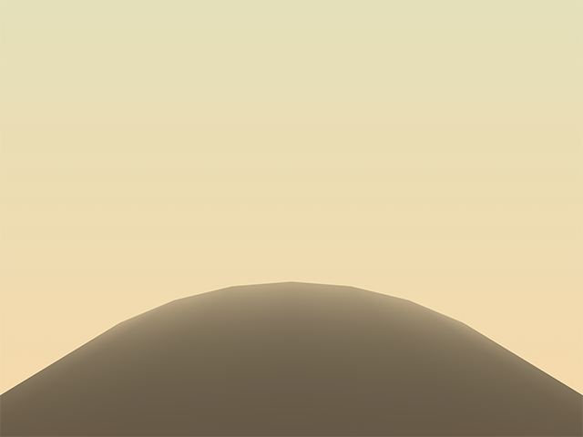

### Adding some lights

Let's add some lights to the scene. Add a file `objects/lights.js` with the following code:

```javascript
import * as THREE from 'three';

export const createLights = () => {
  // A hemisphere light is a gradient colored light; 
  // the first parameter is the sky color, the second parameter is the ground color, 
  // the third parameter is the intensity of the light
  const hemisphereLight = new THREE.HemisphereLight(0xaaaaaa,0x000000, .9)
  
  // A directional light shines from a specific direction. 
  // It acts like the sun, that means that all the rays produced are parallel. 
  const shadowLight = new THREE.DirectionalLight(0xffffff, .9);

  // Set the direction of the light  
  shadowLight.position.set(150, 350, 350);
  
  // Allow shadow casting 
  shadowLight.castShadow = true;

  // define the visible area of the projected shadow
  shadowLight.shadow.camera.left = -400;
  shadowLight.shadow.camera.right = 400;
  shadowLight.shadow.camera.top = 400;
  shadowLight.shadow.camera.bottom = -400;
  shadowLight.shadow.camera.near = 1;
  shadowLight.shadow.camera.far = 1000;

  // define the resolution of the shadow; the higher the better, 
  // but also the more expensive and less performant
  shadowLight.shadow.mapSize.width = 2048;
  shadowLight.shadow.mapSize.height = 2048;

  return {
    hemisphereLight,
    shadowLight
  }
}
```

Write the necessary code in your main script, to call this function, adding the lights to your scene:

```javascript
const { hemisphereLight, shadowLight } = createLights();
scene.add(hemisphereLight);
scene.add(shadowLight);
```

You should see the following result:

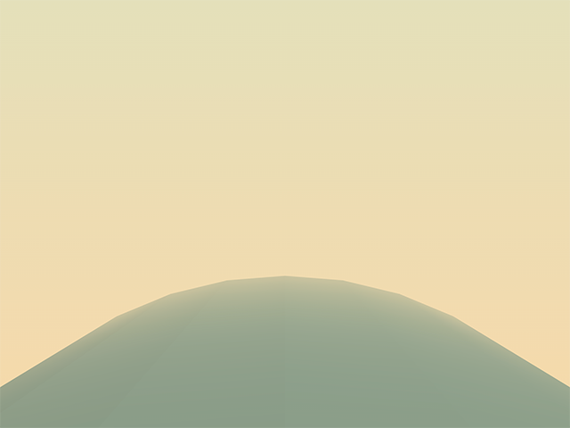

### Adding the sky

Let's create a sky with some clouds. The clouds will be a combination of a couple of meshes.

Create a file `objects/cloud.js` with the following code:

```javascript
import * as THREE from 'three';
import { Colors } from '../constants/colors';

export const createCloud = () => {
  // Create an empty container that will hold the different parts of the cloud
  const mesh = new THREE.Object3D();
  
  // create a cube geometry;
  // this shape will be duplicated to create the cloud
  const geom = new THREE.BoxGeometry(20,20,20);
  
  // create a material; a simple white material will do the trick
  const mat = new THREE.MeshPhongMaterial({
    color:Colors.white,  
  });
  
  // duplicate the geometry a random number of times
  const nBlocs = 3+Math.floor(Math.random()*3);
  for (let i=0; i<nBlocs; i++ ){
    
    // create the mesh by cloning the geometry
    const m = new THREE.Mesh(geom, mat); 
    
    // set the position and the rotation of each cube randomly
    m.position.x = i*15;
    m.position.y = Math.random()*10;
    m.position.z = Math.random()*10;
    m.rotation.z = Math.random()*Math.PI*2;
    m.rotation.y = Math.random()*Math.PI*2;
    
    // set the size of the cube randomly
    const s = .1 + Math.random()*.9;
    m.scale.set(s,s,s);
    
    // allow each cube to cast and to receive shadows
    m.castShadow = true;
    m.receiveShadow = true;
    
    // add the cube to the container we first created
    mesh.add(m);
  }
  return {
    mesh
  }
}
```

This is the code for one single cloud. Create another file `objects/sky.js` where we'll create multiple clouds:

```javascript
import * as THREE from 'three';
import { createCloud } from "./cloud";

export const createSky = () => {
  // Create an empty container
  const mesh = new THREE.Object3D();
  
  // choose a number of clouds to be scattered in the sky
  const nClouds = 20;
  
  // To distribute the clouds consistently,
  // we need to place them according to a uniform angle
  const stepAngle = Math.PI*2 / nClouds;
  
  // create the clouds
  for(let i=0; i<nClouds; i++){
    const { mesh: cloudMesh } = createCloud();
   
    // set the rotation and the position of each cloud;
    // for that we use a bit of trigonometry
    const a = stepAngle*i; // this is the final angle of the cloud
    const h = 750 + Math.random()*200; // this is the distance between the center of the axis and the cloud itself

    // Trigonometry!!! I hope you remember what you've learned in Math :)
    // in case you don't: 
    // we are simply converting polar coordinates (angle, distance) into Cartesian coordinates (x, y)
    cloudMesh.position.y = Math.sin(a)*h;
    cloudMesh.position.x = Math.cos(a)*h;

    // rotate the cloud according to its position
    cloudMesh.rotation.z = a + Math.PI/2;

    // for a better result, we position the clouds 
    // at random depths inside of the scene
    cloudMesh.position.z = -400-Math.random()*400;
    
    // we also set a random scale for each cloud
    const s = 1+Math.random()*2;
    cloudMesh.scale.set(s,s,s);

    // do not forget to add the mesh of each cloud in the scene
    mesh.add(cloudMesh);  
  }

  return {
    mesh
  };
}
```

End with adding the sky to the scene in your main script:

```javascript
const { mesh: skyMesh } = createSky();
skyMesh.position.y = -600;
scene.add(skyMesh);
```

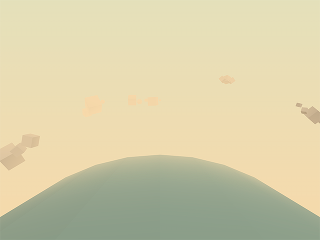

### Creating the airplane

Add another file called `objects/plane.js` with the following code:

```javascript
import * as THREE from 'three';
import { Colors } from '../constants/colors';

export const createPlane = () => {
  
  const mesh = new THREE.Object3D();
  
  // Create the cabin
  const geomCockpit = new THREE.BoxGeometry(60,50,50,1,1,1);
  const matCockpit = new THREE.MeshPhongMaterial({color:Colors.red, flatShading: true});
  const cockpit = new THREE.Mesh(geomCockpit, matCockpit);
  cockpit.castShadow = true;
  cockpit.receiveShadow = true;
  mesh.add(cockpit);
  
  // Create the engine
  const geomEngine = new THREE.BoxGeometry(20,50,50,1,1,1);
  const matEngine = new THREE.MeshPhongMaterial({color:Colors.white, flatShading: true});
  const engine = new THREE.Mesh(geomEngine, matEngine);
  engine.position.x = 40;
  engine.castShadow = true;
  engine.receiveShadow = true;
  mesh.add(engine);
  
  // Create the tail
  const geomTailPlane = new THREE.BoxGeometry(15,20,5,1,1,1);
  const matTailPlane = new THREE.MeshPhongMaterial({color:Colors.red, flatShading: true});
  const tailPlane = new THREE.Mesh(geomTailPlane, matTailPlane);
  tailPlane.position.set(-35,25,0);
  tailPlane.castShadow = true;
  tailPlane.receiveShadow = true;
  mesh.add(tailPlane);
  
  // Create the wing
  const geomSideWing = new THREE.BoxGeometry(40,8,150,1,1,1);
  const matSideWing = new THREE.MeshPhongMaterial({color:Colors.red, flatShading: true});
  const sideWing = new THREE.Mesh(geomSideWing, matSideWing);
  sideWing.castShadow = true;
  sideWing.receiveShadow = true;
  mesh.add(sideWing);
  
  // propeller
  const geomPropeller = new THREE.BoxGeometry(20,10,10,1,1,1);
  const matPropeller = new THREE.MeshPhongMaterial({color:Colors.brown, flatShading: true});
  const propellerMesh = new THREE.Mesh(geomPropeller, matPropeller);
  propellerMesh.castShadow = true;
  propellerMesh.receiveShadow = true;
  
  // blades
  const geomBlade = new THREE.BoxGeometry(1,100,20,1,1,1);
  const matBlade = new THREE.MeshPhongMaterial({color:Colors.brownDark, flatShading: true});
  
  const blade = new THREE.Mesh(geomBlade, matBlade);
  blade.position.set(8,0,0);
  blade.castShadow = true;
  blade.receiveShadow = true;
  propellerMesh.add(blade);
  propellerMesh.position.set(50,0,0);
  mesh.add(propellerMesh);

  return {
    mesh
  }
};
```

Add the plane to the scene in your main script:

```javascript
  const { mesh: planeMesh } = createPlane();
  planeMesh.scale.set(.25,.25,.25);
  planeMesh.position.y = 100;
  scene.add(planeMesh);
```

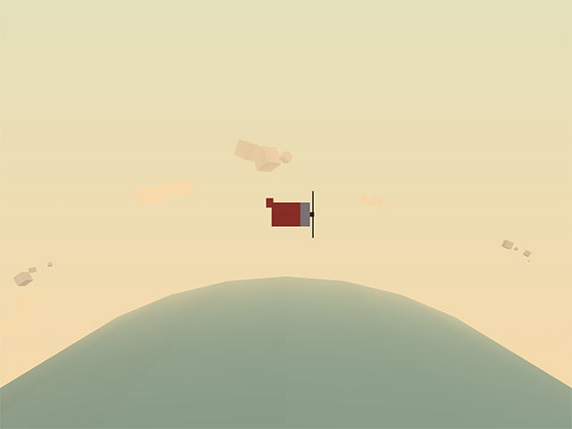

We're still missing something: shadows. While our meshes are set to cast and receive shadows, we haven't enabled shadows on our renderer yet.

Set the shadowMapEnabled property to true on your renderer:

```javascript
renderer.shadowMap.enabled = true;
```

And enjoy some shadows:

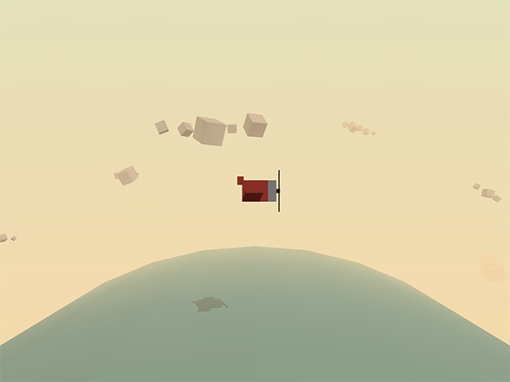

### Adding mouse interaction

We'll add some mouse interaction to our scene, so we can control the plane with our mouse.

First of all, at the top of your main script, define a mousePos const, where we will store the mouse coordinates:

```javascript
const mousePos = {x:0, y:0};
```

Define a handleMouseMove event handler, where you update that mousePos object:

```javascript
const handleMouseMove = (event) => {
  // here we are converting the mouse position value received 
  // to a normalized value varying between -1 and 1;
  // this is the formula for the horizontal axis:
  mousePos.x = -1 + (event.clientX / window.innerWidth)*2;

  // for the vertical axis, we need to inverse the formula 
  // because the 2D y-axis goes the opposite direction of the 3D y-axis
  mousePos.y = 1 - (event.clientY / window.innerHeight)*2;
};
```

Finally, in your init function, link this event handler to the mousemove event on the document:

```javascript
document.addEventListener('mousemove', handleMouseMove, false);
```

We now have a global mouse position, which gets updated automatically when the mouse moves.

Let's update our render loop, so that we take this mouse position into account when rendering the scene.

Create an updatePlane method and a normalize method (to easily transform the mouse position to a value which makes sense for the plane)

```javascript
const updatePlane = () => {
  // let's move the airplane between -100 and 100 on the horizontal axis, 
  // and between 25 and 175 on the vertical axis,
  // depending on the mouse position which ranges between -1 and 1 on both axes;
  // to achieve that we use a normalize function (see below)
  
  const targetX = normalize(mousePos.x, -1, 1, -100, 100);
  const targetY = normalize(mousePos.y, -1, 1, 25, 175);

  // update the airplane's position
  planeMesh.position.y = targetY;
  planeMesh.position.x = targetX;
};

const normalize = (v,vmin,vmax,tmin, tmax) => {
  const nv = Math.max(Math.min(v,vmax), vmin);
  const dv = vmax-vmin;
  const pc = (nv-vmin)/dv;
  const dt = tmax-tmin;
  const tv = tmin + (pc*dt);
  return tv;
};
```

Call the `updatePlane` method in your render loop (you'll get an error):

> Uncaught ReferenceError: planeMesh is not defined

We'll need to move the planeMesh definition into a global variable, so we can access it from the updatePlane method:

```javascript
// at the top of your main file:
let planeMesh = undefined;
```

```javascript
// when creating the plane
const { mesh: localPlaneMesh } = createPlane();
planeMesh = localPlaneMesh;
```

You should now be able to move the plane using your mouse cursor.

### Rotating the clouds and cylinder

We'll update the rotations of the clouds and cylinder in our render loop. In order to do so, we will need to store those mesh definitions in a global variable as well, just like we did with the planeMesh.

```javascript
// at the top of your main file
let seaMesh, skyMesh = undefined;
```

```javascript
// update code to store the meshes in those global variables:
const { mesh: localSeaMesh } = createSea();
seaMesh = localSeaMesh;
seaMesh.position.y = -600;
scene.add(seaMesh);
2
const { mesh: localSkyMesh } = createSky();
skyMesh = localSkyMesh;
skyMesh.position.y = -600;
scene.add(skyMesh);
```

We're now able to modify those meshes in our render loop:

```javascript
seaMesh.rotation.z += .005;
skyMesh.rotation.z += .01;
updatePlane();
```

### Animating the propeller

A plane with no rotating propellet is not a plane. Let's add some animation to the propeller. In order to access the propeller from our render loop, we'll need to return the propeller mesh from our createPlane method as well:

```javascript
return {
  mesh,
  propellerMesh
}
```

In your main script, store the propeller mesh in a global variable:

```javascript
const { mesh: localPlaneMesh, propellerMesh: localPropellerMesh } = createPlane();
planeMesh = localPlaneMesh;
propellerMesh = localPropellerMesh;
```

Finally, update your render loop, so it looks like this:

```javascript
const render = () => {
  if (resizeRendererToDisplaySize(renderer)) {
    const canvas = renderer.domElement;
    camera.aspect = canvas.clientWidth / canvas.clientHeight;
    camera.updateProjectionMatrix();
  }

  seaMesh.rotation.z += .005;
  skyMesh.rotation.z += .01;
  propellerMesh.rotation.x += 0.3;
  updatePlane();

  renderer.render(scene, camera);
  requestAnimationFrame(render);
};
```

## Aviator - Part 2

In the previous part, we've created a basic scene with a plane, clouds and a sea. In this part, we'll make the plane look cooler, and create a moving Sea. Like the initial part, this is an updated version of the original tutorial at https://tympanus.net/codrops/2016/04/26/the-aviator-animating-basic-3d-scene-threejs/.

### Fancy Plane

Duplicate the plane.js file and call it planeFancy.js. Replace the import in your main script, so it used the fancy plane instead of the simple plane.

We're going to modify the vertex positions of the cockpit. Since threejs version 125, you'll need to do this through the position attribute of the shader. This is a bit more complicated than it used to be, but it's also more performant.

Add the following code to your planeFancy.js file, right after creating the `geomCockpit`:

```javascript
const positionAttribute = geomCockpit.attributes.position;
const positionArray = positionAttribute.array;
console.log(positionArray.length / 3);
```

This code gets the position attribute and array, and logs the number of vertices (each vertex has 3 components, for x, y and z, so we divide the length by 3).

You should see the following output in your console:

> 24

This means we have 24 vertices in our cockpit, which seems like a lot for a simple box. This is because we have 6 faces, each with 4 vertices. If we want better control of the vertices, it's better to merge the vertices of the faces, so we'd have 8 vertices instead of 24.

We can merge vertices with [the BufferGeometryUtils.mergeVertices](https://threejs.org/docs/#examples/en/utils/BufferGeometryUtils.mergeVertices) method. This only works when the vertex normals and uvs also correspond, which won't be the case. We'll remove those attributes from the geometry.

Add an import for the BufferGeometryUtils at the top of your planeFancy.js file:

```javascript
import * as BufferGeometryUtils from 'three/addons/utils/BufferGeometryUtils';
```

Update the geomCockpit definition, so it removes the normal and uv attributes, and merges the vertices:

```javascript
let geomCockpit = new THREE.BoxGeometry(60,50,50,1,1,1);
geomCockpit.deleteAttribute( 'normal' );
geomCockpit.deleteAttribute( 'uv' );
geomCockpit = BufferGeometryUtils.mergeVertices( geomCockpit );

const positionAttribute = geomCockpit.attributes.position;
const positionArray = positionAttribute.array;

// test update vertex position
positionArray[0] += 100;

positionAttribute.needsUpdate = true;
```

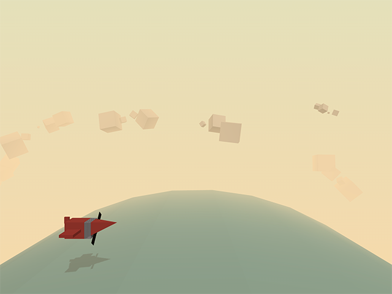

The goal is to make the plane smaller at the back, by modifying the vertex y and z positions of the vertices at the back of the plane. Try to figure this out yourself, before looking at the solution below.

```javascript
positionArray[ 4*3+1 ] -= 10;
positionArray[ 4*3+2 ] += 10;
positionArray[ 5*3+1 ] += 10;
positionArray[ 5*3+2 ] += 10;
positionArray[ 6*3+1 ] -= 10;
positionArray[ 6*3+2 ] -= 10;
positionArray[ 7*3+1 ] += 10;
positionArray[ 7*3+2 ] -= 10;
```

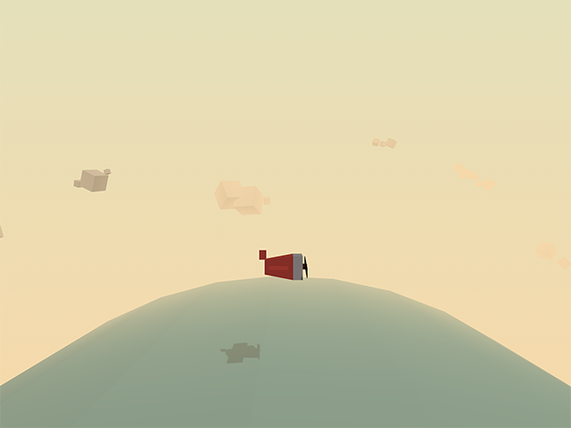

Notice how the wings no longer cast a shadow on the cockpit? This is because our mesh no longer has vertex normals. We can fix this by adding a call to [computeVertexNormals](https://threejs.org/docs/#api/en/core/BufferGeometry.computeVertexNormals) after merging the vertices:

```javascript
geomCockpit.computeVertexNormals();
```

### Morphed Sea

Duplicate the sea.js file into a seaFancy.js, and replace the import in your main script. We'll make this a low-poly moving sea.

1. Remove the normal and uv attributes from the geometry, and merge the vertices.
2. Add some logic to set the vertex x and y position to a random offset

```javascript
for (let i = 0; i < positionArray.length; i += 3) {
  const angle = Math.random()*Math.PI*2;
  const amplitude = 5 + Math.random()*15;
  positionArray[i] = positionArray[i] + Math.cos(angle)*amplitude;
  positionArray[i+1] = positionArray[i+1] + Math.sin(angle)*amplitude;
}
```

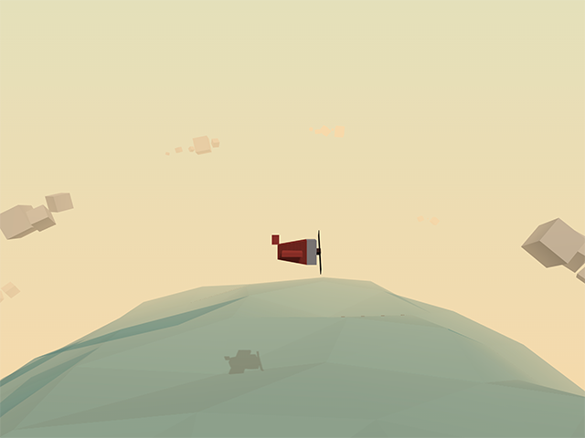

### Animated Sea

We'll now move the sea vertices, so the waves go up and down. In order to do so we will store the original coordinates, target angles and amplitudus in a separate array, and export a method to update the sea.

Replace the previous for-loop with the following:

```javascript
const waves = [];
for (let i = 0; i < positionArray.length; i += 3) {
  const angle = Math.random()*Math.PI*2;
  const amplitude = 5 + Math.random()*15;
  const speed = 0.016 + Math.random()*0.032;
  waves.push({
    x: positionArray[i],
    y: positionArray[i+1],
    angle,
    amplitude,
    speed,
  })
}
```

Right after that for-loop, within your createSea() method, define a function called "animate":

```javascript
const animate = () => {
  for (let i = 0; i < waves.length; i++) {
    let positionIndex = i*3;
    waves[i].angle += waves[i].speed;
    const { x, y, angle, amplitude } = waves[i];
    positionArray[positionIndex] = x + Math.cos(angle)*amplitude;
    positionArray[positionIndex+1] = y + Math.sin(angle)*amplitude;
  }
  positionAttribute.needsUpdate = true;
}
// animate one initial step
animate();
```

Add that animate function to your export:

```javascript
return {
  mesh,
  animate
}
```

In your main script, store the animate method in a global variable (make sure to define `seaAnimate` at the top of your main script)):

```javascript
// adjusted code destructuring the seaMesh and animate method
const { mesh: localSeaMesh, animate: localSeaAnimate } = createSea();
seaMesh = localSeaMesh;
seaAnimate = localSeaAnimate;
```

Call the global `seaAnimate` method in your render loop, and you should see a moving sea.

## ThreeJS + Blender + Shader

There's one more tutorial on the learning platform, which teaches you how to bake lighting and shadows from Blender into a texture and how to integrate a shadertoy fragment shader into that same ThreeJS scene.


# Where to go from here

- http://math.hws.edu/graphicsbook/index.html
- https://github.com/sjfricke/awesome-webgl
- https://thebookofshaders.com/
- https://www.august.com.au/blog/animating-scenes-with-webgl-three-js
- https://tympanus.net/codrops/2017/05/09/infinite-tubes-with-three-js/
